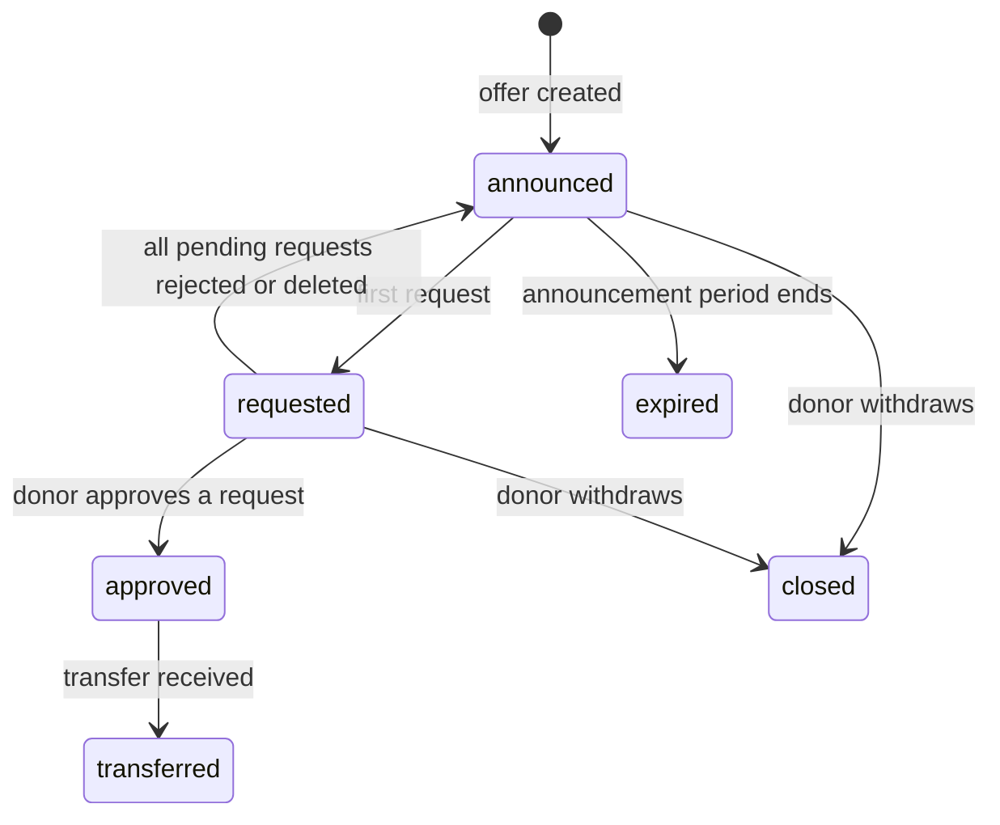

# LabSurplus

A Spring Boot REST API that helps research labs pass their surplus supplies to other labs that need them, **before the supplies expire**.

Reagents, culture media and consumables often expire unused on one lab's shelf while another lab orders the same item new and waits for it to arrive. LabSurplus gives labs visibility into each other's surplus, warns them early about items close to expiry, and handles the whole exchange: offer, request, approval, transfer and receipt. It's donation only: nothing is sold.

## Table of contents

- [Features](#features)
- [Tech stack](#tech-stack)
- [How it works](#how-it-works)
- [Data model](#data-model)
- [API endpoints](#api-endpoints)
- [Getting started](#getting-started)
- [Example flow](#example-flow)
- [Project structure](#project-structure)

## Features

- **Early warning.** Flags items that expire within 6 months and haven't been used in 3 months, and emails the lab a list of them.
- **Surplus offers.** Labs post surplus stock as offers. Offered stock is reserved, so it can't be offered twice or consumed while the offer is open.
- **Requests with justification.** Other labs request an offer and explain why they need it. A lab can't request its own surplus.
- **AI suggestion.** Gemini compares the pending requests on an offer and recommends one. The donor lab makes the final decision.
- **One-click approval.** Approving one request rejects the others on the same offer and notifies every lab involved.
- **Tracked transfers.** Receiving a transfer moves the stock to the receiving lab with the same lot number and expiry date, and records who received it and at what temperature.
- **Email notifications.** Labs get an email at every step: near-expiry alerts, new requests, approvals, rejections, withdrawn offers, shipments and receipts.
- **Impact numbers.** Each lab can see the value it saved, donated and wasted, in SAR.

## Tech stack

| Layer | Technology |
|---|---|
| Language | Java 17+ |
| Framework | Spring Boot 3 (Web, Data JPA, Validation, Mail) |
| AI | Google Gemini API, called with Spring's `RestClient` |
| Email | Gmail SMTP via `JavaMailSender` |
| Database | MySQL |
| Utilities | Lombok |
| Testing | Postman |

## How it works

```
Detect → Offer → Request → AI suggestion → Approve → Transfer → Receive
```

1. **Detect.** `nearExpiry` finds items that are close to expiry and unused, and `notifyNearExpiry` emails them to the lab.
2. **Offer.** The lab posts the item as a surplus offer with an announcement end date.
3. **Request.** Other labs request the offer with a quantity and a justification.
4. **AI suggestion.** When an offer has two or more pending requests, `summary` asks Gemini to recommend one.
5. **Approve.** The donor approves one request. The others are rejected automatically.
6. **Transfer.** A transfer is created from the donor to the approved lab.
7. **Receive.** The receiving lab confirms receipt with the receiver's name and the temperature. The stock moves between the two inventories.

### Offer lifecycle



Requests move from `pending` to either `approved` or `rejected`.

### AI design choices

- **No bias toward a center.** Lab names are never sent to the model, only the item details and each request's quantity and justification.
- **Protected against prompt injection.** Justifications are fenced with delimiters, and the model is told to treat them as data. The delimiter characters are stripped from the text first, so a lab can't close the fence and add instructions.
- **Cost-aware.** The AI is only called when there are at least two pending requests to compare.
- **Fails safely.** If the AI call fails or times out, the endpoint still returns the pending requests with a message, and the donor decides manually.
- **Suggestion only.** The model recommends; the donor approves.

## Data model

| Entity | Key fields |
|---|---|
| `Lab` | `name` (unique), `centerId`, `headName`, `email` |
| `InventoryItem` | `labId`, `name`, `category`, `lotNumber`, `quantity`, `unit`, `unitPrice`, `expiryDate`, `storageCondition`, `lastConsumedDate` |
| `SurplusOffer` | `itemId`, `donorLabId` (set automatically), `quantity`, `announcedUntil`, `urgent`, `status` |
| `SurplusRequest` | `offerId`, `requestingLabId`, `quantity`, `justification`, `status` |
| `Transfer` | `offerId` (unique), `fromLabId` (set automatically), `toLabId`, `type` (`internal` or `external`), `receivedBy`, `receivedTemperature`, `receivedAt` |

Fields marked "set automatically", along with every `status`, are set by the system. Values sent for them in a request body are ignored.

## API endpoints

Base URL: `http://localhost:8080/api/v1`

Every resource has the standard CRUD endpoints:

| Method | Path | Description |
|---|---|---|
| `GET` | `/{resource}/get` | List all |
| `POST` | `/{resource}/add` | Create |
| `PUT` | `/{resource}/update/{id}` | Update |
| `DELETE` | `/{resource}/delete/{id}` | Delete |

Where `{resource}` is `lab`, `item`, `offer`, `request` or `transfer`.

### Extra endpoints

**Inventory**

| Method | Path | Description |
|---|---|---|
| `PUT` | `/item/consume/{itemId}/{amount}` | Record usage; reserved stock can't be consumed |
| `GET` | `/item/nearExpiry/{labId}` | Items expiring within 6 months and unused for 3 |
| `POST` | `/item/notifyNearExpiry/{labId}` | Email the near-expiry list to the lab |

**Offers**

| Method | Path | Description |
|---|---|---|
| `GET` | `/offer/open` | All open offers |
| `GET` | `/offer/available/{labId}` | Open offers a lab can request (excludes its own) |
| `GET` | `/offer/byCategory/{category}` | Open offers by item category |
| `GET` | `/offer/urgent` | Open offers marked urgent |
| `PUT` | `/offer/close/{offerId}` | Donor withdraws an offer; pending requests are rejected |
| `PUT` | `/offer/expireOld` | Expire announced offers whose announcement period ended |

**Requests**

| Method | Path | Description |
|---|---|---|
| `GET` | `/request/byOffer/{offerId}` | All requests on an offer (the donor's view) |
| `GET` | `/request/byLab/{labId}` | All requests a lab has made (the requester's view) |
| `GET` | `/request/summary/{offerId}` | AI recommendation between the pending requests |
| `PUT` | `/request/approve/{requestId}` | Approve a request and reject the others on the offer |
| `PUT` | `/request/reject/{requestId}` | Reject a request |

**Transfers**

| Method | Path | Description |
|---|---|---|
| `GET` | `/transfer/pending/{labId}` | Transfers on their way to a lab, not yet received |
| `PUT` | `/transfer/receive/{transferId}/{receivedBy}/{temperature}` | Confirm receipt and move the stock |

**Impact**

| Method | Path | Description |
|---|---|---|
| `GET` | `/lab/savedValue/{labId}` | Value of supplies the lab received instead of buying |
| `GET` | `/lab/donatedValue/{labId}` | Value of supplies the lab gave to other labs |
| `GET` | `/lab/wastedValue/{labId}` | Value of expired items still in the lab's stock |

### Responses

Successful actions return `200` with a message. Validation errors and broken business rules return `400` with a message explaining why, for example:

```json
{ "message": "Offered quantity is more than what the lab has available" }
```

## Getting started

### Prerequisites

- Java 17 or later
- MySQL
- A Gemini API key from [Google AI Studio](https://aistudio.google.com/)
- A Gmail account with an [App Password](https://support.google.com/accounts/answer/185833) (needs 2-Step Verification)

### Configuration

Set these in `src/main/resources/application.properties`. Keep secrets in environment variables so they never end up in the repository:

```properties
# Database
spring.datasource.url=jdbc:mysql://localhost:3306/labsurplus
spring.datasource.username=${DB_USERNAME}
spring.datasource.password=${DB_PASSWORD}
spring.jpa.hibernate.ddl-auto=update

# Gemini
gemini.api.key=${GEMINI_API_KEY}
ai.model=${AI_MODEL}

# Gmail SMTP
spring.mail.host=smtp.gmail.com
spring.mail.port=587
spring.mail.username=${MAIL_USERNAME}
spring.mail.password=${MAIL_APP_PASSWORD}
spring.mail.properties.mail.smtp.auth=true
spring.mail.properties.mail.smtp.starttls.enable=true
```

`AI_MODEL` is the name of the Gemini model to use, as listed in Google AI Studio.

### Run

```bash
git clone https://github.com/[your-username]/labsurplus.git
cd labsurplus
./mvnw spring-boot:run
```

The API starts on `http://localhost:8080`. To check that the Gemini key works, call `GET /api/v1/ai/test`.

## Example flow

A lab with surplus Taq polymerase passes it to a lab that needs it:

```http
POST /api/v1/item/add
{
  "labId": 1, "name": "Taq Polymerase", "category": "Reagent", "lotNumber": "TQ-2291",
  "quantity": 20, "unit": "vial", "unitPrice": 150,
  "expiryDate": "2027-02-27", "storageCondition": "4C"
}

GET  /api/v1/item/nearExpiry/1                 → the item is flagged

POST /api/v1/offer/add
{ "itemId": 1, "quantity": 10, "announcedUntil": "2026-10-10", "urgent": true }

POST /api/v1/request/add
{ "offerId": 1, "requestingLabId": 2, "quantity": 10,
  "justification": "We run about 40 PCR reactions a week for our TB surveillance study." }

GET  /api/v1/request/summary/1                 → AI recommendation (with 2+ requests)
PUT  /api/v1/request/approve/1                 → other requests rejected, labs emailed

POST /api/v1/transfer/add
{ "offerId": 1, "toLabId": 2, "type": "internal" }

PUT  /api/v1/transfer/receive/1/Sara/4.5       → stock moves to lab 2
GET  /api/v1/lab/savedValue/2                  → 1500.0 SAR
```

## Project structure

```
src/main/java/com/example/labsurplus/
├── Api/          ApiResponse
├── Controller/   REST controllers, one per resource, plus AiController
├── DTO/          RequestSummary
├── Model/        JPA entities
├── Repository/   Spring Data JPA repositories
└── Service/      Business logic, AiService (Gemini) and EmailService (Gmail)
```

## Author

Built as a capstone project by [Your name].
